## Splitnice

Splitnice is a on-chain solution to solve the bill splitting problems. It has the following features:

- Multi-sig: Owner proposes an amount and participants will approve it before the contract is deployed
- ERC721 (NFT): Owner can transfer the ownership of the bill to someone.
- ERC20 (USDC): Payments are settled in USDC
- Owner can withdraw fund after all the participants has paid, and the NFT will be burned.

## Disclaimer

This code has not been audited (I haven't had the time to audit it), so use at your own risk.

## Pre-requisites

- Foundry
```sh
curl -L https://foundry.paradigm.xyz | bash
```

- OpenZeppelin Contracts

```sh
forge install OpenZeppelin/openzeppelin-contracts
```

## Build

```shell
forge build
```

## Test

```shell
forge test
```

## On-Chain End to End Test

### Deployment

Startup Anvil (In a separate terminal)

```sh
anvil
```

Deploy
```sh
forge script script/SplitBillFactory.s.sol --fork-url http://127.0.0.1:8545 --broadcast \
--sender 0xa0Ee7A142d267C1f36714E4a8F75612F20a79720 \
--private-key 0x2a871d0798f97d79848a013d4936a73bf4cc922c825d33c1cf7073dff6d409c6
```
> Never do this in prod, please use `cast wallet import` to import the private key to your foundry keystore first
>
> Never share your private key to other people

Read the Contract Address from terminal: 

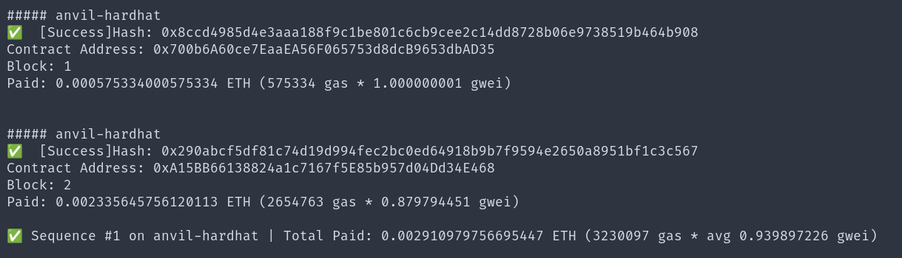

```sh
 # replace this with your own addr, in anvil, it should be the same
export USDC_ADDR=0x700b6A60ce7EaaEA56F065753d8dcB9653dbAD35
export FACTORY_ADDR=0xA15BB66138824a1c7167f5E85b957d04Dd34E468
```

Get NFT address from the function:

```sh
cast call $FACTORY_ADDR "getNftAddress()"
```

Export the address:

```sh
export NFT_ADDR=0x07e06c8fab4a6bf1e242f3d786bc5b19785bb921
```

Verify USDC is deployed properly (local test only):

```sh
cast call $USDC_ADDR "totalSupply()"
```
Output:
```
0x000000000000000000000000000000000000000000000000000000e8d4a51000
```
Which converts to 1000000000000 = 1 mil USDC

Give some accounts 1000 USDC (local test only, on testnets please use a faucet, on mainnet please get some USDC
through swapping):

```sh
cast send $USDC_ADDR "transfer(address,uint256)" 0x70997970C51812dc3A010C7d01b50e0d17dc79C8 1000000000 --private-key 0x2a871d0798f97d79848a013d4936a73bf4cc922c825d33c1cf7073dff6d409c6 --rpc-url http://127.0.0.1:8545
cast send $USDC_ADDR "transfer(address,uint256)" 0x3C44CdDdB6a900fa2b585dd299e03d12FA4293BC 1000000000 --private-key 0x2a871d0798f97d79848a013d4936a73bf4cc922c825d33c1cf7073dff6d409c6 --rpc-url http://127.0.0.1:8545
cast send $USDC_ADDR "transfer(address,uint256)" 0x90F79bf6EB2c4f870365E785982E1f101E93b906 1000000000 --private-key 0x2a871d0798f97d79848a013d4936a73bf4cc922c825d33c1cf7073dff6d409c6 --rpc-url http://127.0.0.1:8545
```

We should see 3 consecutive blocks:

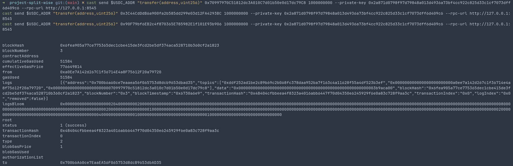

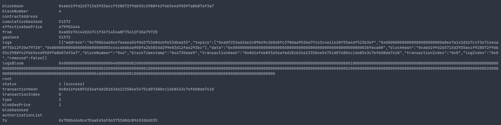

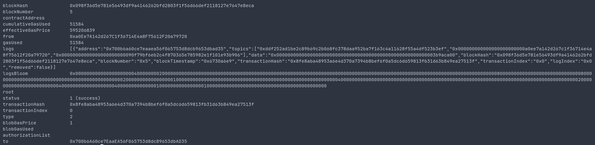

### Interacting with the Contract


#### 1. Create a new `SplitBill` Smart Contract using `createProposal` with 120 USDC (usdc has 6 decimals, so everything is multiplied by 10^6) and 3 contributors.

```sh
cast send --private-key 0xac0974bec39a17e36ba4a6b4d238ff944bacb478cbed5efcae784d7bf4f2ff80 $FACTORY_ADDR \
"createProposal(uint256, address[], uint256)" \
120000000 "[0x70997970C51812dc3A010C7d01b50e0d17dc79C8,0x3C44CdDdB6a900fa2b585dd299e03d12FA4293BC,0x90F79bf6EB2c4f870365E785982E1f101E93b906]" 3
```

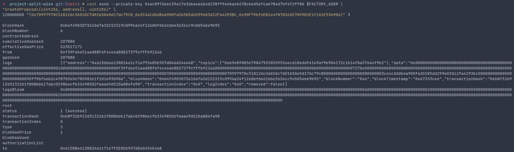

#### 2. Participants Approval

Participants need to approve before the `SplitBill` contract gets deployed.

```sh
cast send --private-key 0x59c6995e998f97a5a0044966f0945389dc9e86dae88c7a8412f4603b6b78690d $FACTORY_ADDR \
"approveProposal(uint256)" 0
cast send --private-key 0x5de4111afa1a4b94908f83103eb1f1706367c2e68ca870fc3fb9a804cdab365a $FACTORY_ADDR \
"approveProposal(uint256)" 0
cast send --private-key 0x7c852118294e51e653712a81e05800f419141751be58f605c371e15141b007a6 $FACTORY_ADDR \
"approveProposal(uint256)" 0
```

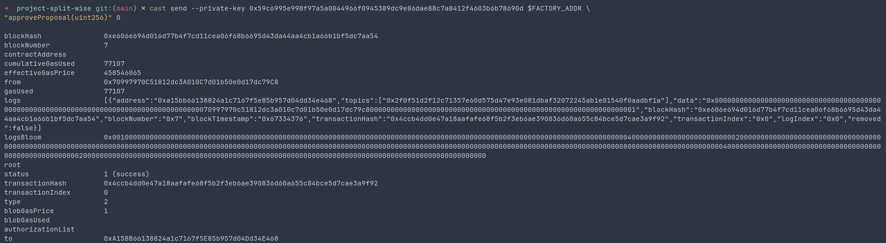

#### 3. Get the `SplitBill()`

```sh
cast call $FACTORY_ADDR "getDeployedSplitBills()" --from 0xf39Fd6e51aad88F6F4ce6aB8827279cffFb92266
```
We get:

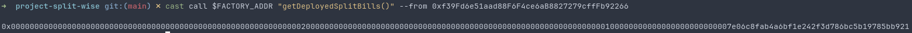

We have 1 contract deployed, so we just need to copy the last few hexes.

```sh
export BILL_ADDR=0xe88c975ff7dc40e80a84b6d0a81f23317322f325 # remember the 0x
```

#### 3. Get the `Amount Payable` for Friend 1 from the Smart Contract

```sh
cast call $BILL_ADDR "getAmountPayable(address)" 0x70997970C51812dc3A010C7d01b50e0d17dc79C8
```

We get:

```
0x0000000000000000000000000000000000000000000000000000000002625a00
```

Which if we convert to decimal is 40000000 (120000000 split between 3 persons), the math is correct.

#### 4. Now we can pay with this address 

Approve the bill address to spend tokens
```sh
cast send $USDC_ADDR "approve(address,uint256)" $BILL_ADDR 40000000 \
--private-key 0x59c6995e998f97a5a0044966f0945389dc9e86dae88c7a8412f4603b6b78690d \
--rpc-url http://127.0.0.1:8545
```

Send some USDC to the contract
```sh
cast send --private-key 0x59c6995e998f97a5a0044966f0945389dc9e86dae88c7a8412f4603b6b78690d \
$BILL_ADDR "contribute(uint256)" 40000000 \
--from 0x70997970C51812dc3A010C7d01b50e0d17dc79C8
```
> Note: For ERC20s we need to approve them before spending, this is not a problem for ETH

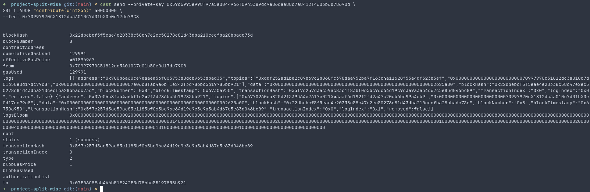

Success! 

#### 5. We should check whether he has contributed.

```sh
cast call $BILL_ADDR "getContribution(address)" 0x70997970C51812dc3A010C7d01b50e0d17dc79C8
```

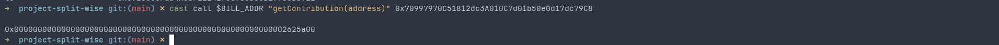

Looks like he did!

#### 6. Now we can repeat step 3 to 5 for other friends

```sh
cast send $USDC_ADDR "approve(address,uint256)" $BILL_ADDR 40000000 \
--private-key 0x5de4111afa1a4b94908f83103eb1f1706367c2e68ca870fc3fb9a804cdab365a \
--rpc-url http://127.0.0.1:8545

cast send $USDC_ADDR "approve(address,uint256)" $BILL_ADDR 40000000 \
--private-key 0x7c852118294e51e653712a81e05800f419141751be58f605c371e15141b007a6 \
--rpc-url http://127.0.0.1:8545

cast send --private-key 0x5de4111afa1a4b94908f83103eb1f1706367c2e68ca870fc3fb9a804cdab365a \
$BILL_ADDR "contribute(uint256)" 40000000 \
--from 0x3C44CdDdB6a900fa2b585dd299e03d12FA4293BC

cast send --private-key 0x7c852118294e51e653712a81e05800f419141751be58f605c371e15141b007a6 \
$BILL_ADDR "contribute(uint256)" 40000000 \
--from 0x90F79bf6EB2c4f870365E785982E1f101E93b906
```

#### 7. Check the contract USDC balance:

```sh
cast call $USDC_ADDR "balanceOf(address)(uint256)" $BILL_ADDR
```

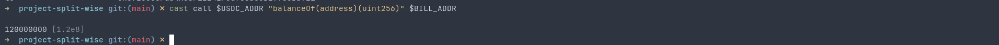

#### 8. The owner withdraws the money

Owner's current balance:

```sh
cast call $USDC_ADDR "balanceOf(address)(uint256)" 0xf39Fd6e51aad88F6F4ce6aB8827279cffFb92266
```

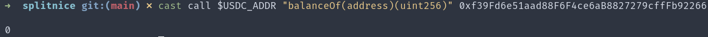

Owner approve SplitBill:

```sh
cast send --private-key 0xac0974bec39a17e36ba4a6b4d238ff944bacb478cbed5efcae784d7bf4f2ff80 \
$NFT_ADDR "approve(address,uint256)" $BILL_ADDR 1
```

Owner withdraws:

```sh
cast send --private-key 0xac0974bec39a17e36ba4a6b4d238ff944bacb478cbed5efcae784d7bf4f2ff80 \
$BILL_ADDR "withdraw()" \
--from 0xf39Fd6e51aad88F6F4ce6aB8827279cffFb92266
```

Owner new balance:

```sh
cast call $USDC_ADDR "balanceOf(address)(uint256)" 0xf39Fd6e51aad88F6F4ce6aB8827279cffFb92266
```

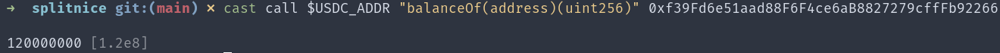

